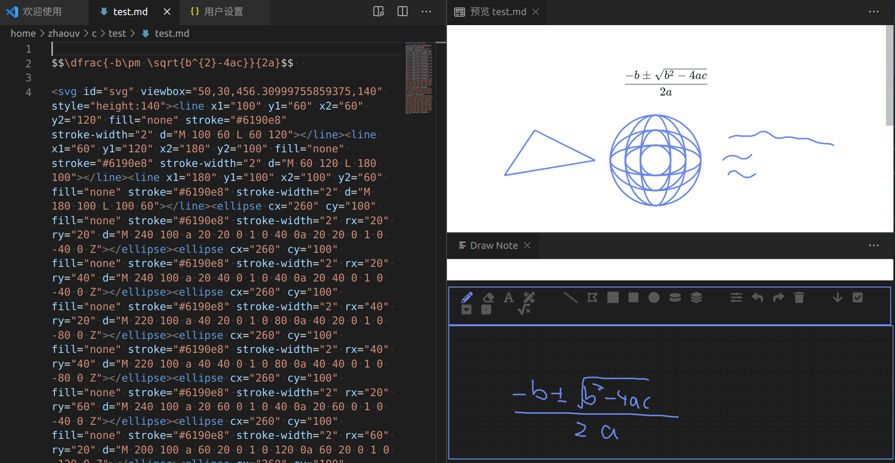

# Draw Note

[](https://github.com/zhaouv/vscode-markdown-draw/stargazers) [](https://github.com/zhaouv/vscode-markdown-draw/network/members) [](https://github.com/zhaouv/vscode-markdown-draw/issues) [](https://github.com/zhaouv/vscode-markdown-draw/blob/master/LICENSE) [](https://marketplace.visualstudio.com/items?itemName=zhaouv.vscode-markdown-draw)

**This project is in the prototype stage !**

Draw svg quick-responsively with a mouse or pen,  
Designed for note-taking, formulas drafting

OCR to latex supported now (by [Customize-Buttons and myscript API](#Convert-formulas-to-latex))



## Usage

open markdown file, right click at some line,  
`Edit/Create current line as SVG`

or press `F1`, type `svg`, click the command

## Customize Buttons

I have not decided the interface. In this stage, it could work this way.

Step 1. You should change the following code(icon/title/onclick), run it in chrome console. It prints one line of string.

```js
console.log(JSON.stringify((()=>{

    // find a icon from https://fontawesome.com/v5.8.2/icons
    const icon = 'beer' 
    const title = 'a new button'
    const addGap = true
    const onclick = ()=>{
        drawAPI.unstable.setTextContent('a custom button works')
    }

    document.querySelector('div.svg-operate').insertAdjacentHTML('beforeEnd',(addGap?"<span class='svgiconspliter'></span>":"")+"<div class='svg-btn fa fa-"+icon+"' title='"+title+"'><span></span></div>");
    document.querySelector('div.svg-operate > :last-child').onclick=onclick

}).toString().slice(7,-2)))
```

`"    // find a icon from https://fontawesome.com/v5.8.2/icons\n    const icon = 'beer' \n    const title = 'a new button'\n    const addGap = true\n    const onclick = ()=>{\n        drawAPI.unstable.setTextContent('a custom button works')\n    }\n\n    document.querySelector('div.svg-operate').insertAdjacentHTML('beforeEnd',(addGap?\"<span class='svgiconspliter'></span>\":\"\")+\"<div class='svg-btn fa fa-\"+icon+\"' title='\"+title+\"'><span></span></div>\");\n    document.querySelector('div.svg-operate > :last-child').onclick=onclick\n"`

Step 2. Push the string into your settings.json

```json
    "markdown-draw.customized-buttons": [
        {
            "type": "script",
            "version": "0.1.2",
            "function": "    // find a icon from https://fontawesome.com/v5.8.2/icons\n    const icon = 'beer' \n    const title = 'a new button'\n    const addGap = true\n    const onclick = ()=>{\n        drawAPI.unstable.setTextContent('a custom button works')\n    }\n\n    document.querySelector('div.svg-operate').insertAdjacentHTML('beforeEnd',(addGap?\"<span class='svgiconspliter'></span>\":\"\")+\"<div class='svg-btn fa fa-\"+icon+\"' title='\"+title+\"'><span></span></div>\");\n    document.querySelector('div.svg-operate > :last-child').onclick=onclick\n"
        }
    ]
```

### Convert formulas to latex

Recognitize handwritten text to latex using API of myscript.com  
which declares `MyScript has been working on this matter for over two decades now and there is no question that our technology is ahead of Microsoft Ink Recognizer. ` at their [article](https://medium.com/@myscript/microsoft-ink-recognizer-an-opportunity-for-myscript-9e55fe45afae).  
Create a account at https://developer.myscript.com/getting-started/web to get token.  
It is free for 2000 calls/month.  

Paste your token on `PasteYourTokenHere`, and push this into setting.json following the previous section [Customize Buttons](#Customize-Buttons). The json generated from [this script](https://github.com/zhaouv/vscode-markdown-draw/blob/master/buttons_demo/htr_to_latex_myscriptapi.js)

```json
{"type":"script","version":"0.1.2","function":"var token = {\n applicationKey: 'PasteYourTokenHere',\n hmacKey: 'PasteYourTokenHere',\n}\nvar addGap = true\n\nvar iink_cdn = 'https://cdn.jsdelivr.net/npm/iink-js@1.4.5/dist/iink.min.js'\n// var iink_cdn = https://unpkg.com/iink-js@1.4.5/dist/iink.min.js\n// var iink_cdn = https://myscript.github.io/iinkJS/dist/iink.min.js\n\nvar icon = 'square-root-alt'\nvar title = 'Recognize to latex'\n\ndocument.querySelector('div.svg-operate').insertAdjacentHTML('beforeEnd', (addGap ? \"<span class='svgiconspliter'></span>\" : \"\") + \"<div class='svg-btn fa fa-\" + icon + \"' title='\" + title + \"'><span></span></div>\");\nvar btnElement = document.querySelector('div.svg-operate > :last-child')\nbtnElement.onclick = ()=>{drawAPI.unstable.setTextContent('loading script')}\n\nvar svg = drawAPI.unstable.getSVGElement()\n\nvar getStrokeGroups = () => {\n let strokes = []\n for (const item of svg.children) {\n if (item.nodeName === 'path') {\n let points = item\n .getAttributeNS(null, \"d\")\n .split(/M |L /g)\n .slice(1)\n .map(item => {\n return {\n x: parseFloat(item.split(\",\")[0]),\n y: parseFloat(item.split(\",\")[1])\n };\n })\n strokes.push({ x: points.map(v => v.x), y: points.map(v => v.y) })\n }\n }\n console.log(strokes);\n return [{ \"penStyle\": null, \"strokes\": strokes }]\n}\n\nvar s1 = document.createElement('script')\ns1.setAttribute('nonce', drawAPI.unstable.nonce())\ns1.src = iink_cdn\ns1.onload = () => {\n\n const onclick = () => {\n drawAPI.unstable.setTextContent('calling the API')\n // Creating a recognizer\n const iinkRecognizer = iink.DefaultBehaviors.recognizerList.find(x => {\n const infos = x.getInfo();\n return infos.protocol === 'REST';\n });\n\n // Creating a empty model\n const model = iink.InkModel.createModel();\n // Filling the model with the stroke groups\n model.strokeGroups = getStrokeGroups();\n\n // Creating a recognizer context with the configuration attached\n const recognizerContext = iink.RecognizerContext.createEmptyRecognizerContext({\n configuration: iink.DefaultConfiguration\n });\n\n recognizerContext.editor.configuration.recognitionParams = {\n type: 'MATH',\n protocol: 'REST',\n server: {\n scheme: 'https',\n // host: 'webdemoapi.myscript.com',\n host: 'cloud.myscript.com',\n applicationKey: token.applicationKey,\n hmacKey: token.hmacKey\n },\n iink: {\n math: {\n mimeTypes: [\n 'application/x-latex',\n ],\n }\n }\n }\n\n // Assigning a theme to the document\n recognizerContext.editor.theme = iink.DefaultTheme;\n\n // Defining the behaviour on recognition result\n const recognitionCallback = (err, x) => {\n if (!err) {\n Object.entries(x.exports)\n .forEach(([mimeType, exportValue]) => {\n\n let latex = x.exports[mimeType]\n let content = '\\n$$'+latex.trim()+'$$ '+' '\n drawAPI.unstable.setTextContent('')\n drawAPI.unstable.editCurrentLine({\n control: 0,\n text: content\n })\n });\n }\n };\n\n // Triggering the recognition\n iinkRecognizer.export_(recognizerContext, model)\n .then((values) => {\n values.forEach((value) => {\n recognitionCallback(undefined, value);\n });\n })\n .catch(err => recognitionCallback(err, undefined));\n }\n\n btnElement.onclick = onclick\n}\ndocument.body.appendChild(s1)\n"}
```

Actually it is HTR not OCR.  
I also know that using the mathpix API is a popular choice for OCR to latex.  
Its API it free for 1000/month, but you have to provide a card. 
They charge a one-time non-refundable setup fee of $1.  
Anyway the calling script of mathpix API is easy to write, 
I may pay them one dollar and then provide a new button later.

## License

[Apache-2.0](./LICENSE)

board adapted from [syfxlin/graffiti-board](https://github.com/syfxlin/graffiti-board/tree/5945b126c945073eced5e6eb78658bc2a7375881) Apache-2.0  
> with lots of changes

board/Font-Awesome-5-8-2-all-min.css from Font Awesome Free 5.8.2 by @fontawesome - https://fontawesome.com License - https://fontawesome.com/license/free (Icons: CC BY 4.0, Fonts: SIL OFL 1.1, Code: MIT License)  
> replace webfonts/fa-solid-900.woff2 by base64